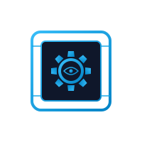

<h1 align="center">
  <br>
  cogbox
</h1>

<p align="center">
  A NixOS <a href="https://github.com/microvm-nix/microvm.nix">microvm</a> sandbox for running coding-agent harnesses with permission prompts disabled.
</p>

Each harness's host config and auth tokens are mounted into an isolated
QEMU guest where the agent can read, write, and run commands without
prompting -- without that blast radius reaching the host.

Currently supported harnesses: `claude-code`
([Claude Code](https://docs.anthropic.com/en/docs/claude-code)),
`opencode` ([opencode](https://github.com/sst/opencode)), and
`codex` ([OpenAI Codex CLI](https://github.com/openai/codex)). The
architecture is harness-agnostic; adding more is a matter of declaring
their host paths and launcher in `flake.nix`.

## Quick start

```
nix run github:illustris/cogbox
```

On first run, the wrapper asks which harnesses to set up (only the ones
you pick get host-side config dirs created) and then prompts before
touching anything:

```
No harness state detected. Set up which?
  [1] claude-code     (creates ~/.claude/, ~/.claude.json)
  [2] opencode        (creates ~/.config/opencode/, ~/.local/share/opencode/)
  [3] codex           (creates ~/.codex/)
  [4] all
Choice [1-4, comma-separated for multiple]:

The following paths will be created:
  ~/.config/cogbox/instances/default/config.json  (default settings)
  ~/.config/cogbox/authorized_keys  (SSH public keys; seeded from ~/.ssh/*.pub + ssh-add -L)
  ~/.local/share/cogbox/instances/default/  (VM data)
  ~/.claude/  (claude-code config)
  ~/.claude.json  (claude-code auth)
  ~/.config/opencode/  (opencode config)
  ~/.local/share/opencode/  (opencode data)
  ~/.codex/  (codex home)

Continue? [y/N]
```

The VM then starts in the background and, by default, `cogbox` waits for
the guest's SSH server to come up and drops you straight into an SSH
session. When you exit the session the VM keeps running (stop it with
`cogbox stop`). Pass `--no-ssh` to just start it and return, or `-f` to
watch it boot on the serial console instead (foreground: `Ctrl-]` detaches
without stopping the VM).

Each enabled harness ships a launcher inside the VM: `c` for
`claude-code`, `oc` for `opencode`, `cx` for `codex`. All three binaries
are installed unconditionally (subject to per-architecture availability),
so once the VM boots any of them is on `$PATH`.

If a harness's host state already exists when you run cogbox for the
first time, the harness selection prompt is skipped and only those
harnesses are activated -- so existing single-harness installs are
unaffected.

## Named instances

Run multiple isolated VMs simultaneously, like Wine prefixes. Each named
instance gets its own data directory, overlay image, and network ports.

```sh
# Default instance (starts in the background, then SSHes in)
nix run github:illustris/cogbox

# Create and start a named instance
nix run github:illustris/cogbox -- --name work
nix run github:illustris/cogbox -- --name personal --vcpu 8 --mem 16384

# List all instances and their ports
nix run github:illustris/cogbox -- list
```

Ports are auto-assigned when an instance is first created (default starts
at SSH 2222 / HTTP 8080; each new instance increments by one). You can
override ports by editing the instance config.

Harness authentication and base config are shared across all instances:

| Harness | Host config | Host auth/data |
|---|---|---|
| claude-code | `~/.claude/` | `~/.claude.json` |
| opencode | `~/.config/opencode/` | `~/.local/share/opencode/` (includes `auth.json`) |
| codex | `~/.codex/` | `~/.codex/` (includes `auth.json`) |

Each instance gets its own overlay on top of the shared config, so
per-instance harness settings persist independently.

The guest's kernel hostname is set to `cogbox-<instance>` at boot
(e.g. `cogbox-default`, `cogbox-work`), so shell prompts and SSH
banners distinguish concurrent instances.

Interactive login shells start in `/var/lib/cogbox` (the persisted,
host-shared data dir) rather than root's home, so the autologin session
opens where the instance's state lives.

## CLI

cogbox uses a verb-based CLI. Bare `cogbox` (no verb) is sugar for
`cogbox start`, so the most common invocation stays short. By default
`start` launches the VM in the background and then opens an SSH session
into it; `--no-ssh` skips that and just returns.

The VM always runs as a background daemon. Its serial console and QEMU
monitor each live on a per-instance Unix socket, so you can attach and
detach freely (Ctrl-] detaches) without ever stopping the VM. "Foreground"
is just `start -f`: launch, then auto-attach the console.

### Verbs

| Verb | Description |
|---|---|
| `start` | Init if needed, launch the VM in the background, then SSH into it (default verb). With `--no-ssh` it just returns; with `-f` it attaches the serial console after launch. |
| `console` | Attach the serial console of a running instance. `Ctrl-]` detaches; the VM keeps running. |
| `monitor` | Attach the QEMU (HMP) monitor of a running instance. `Ctrl-]` detaches. |
| `stop` | Stop a running instance (SIGTERM, then SIGKILL with `--force`) |
| `restart` | `stop` then `start` |
| `status` | Print whether an instance is running, plus ports/net mode |
| `list` | List all instances. `--json` for machine-readable output |
| `init` | Create config + host directories without launching |
| `ssh` | Connect to a running instance via SSH |
| `rules` | Manage CIDR (L4) allow/deny rules for an instance |
| `remap` | Manage TCP destination-remap rules |
| `l7` | Manage L7 (vhost) allow/deny rules for an instance |
| `help` | `cogbox help VERB` ≡ `cogbox VERB --help` |

The `run` verb from earlier versions has been removed: bare `cogbox` now
starts the VM in the background and SSHes into it, `cogbox --no-ssh` just
starts it, and `cogbox -f` is the foreground (serial-console) equivalent.

Run `cogbox VERB --help` for verb-specific options.

### Common options

| Flag | Verbs | Description |
|---|---|---|
| `-n, --name NAME` | every verb that takes an instance | Instance name (default: `default`) |
| `-h, --help` | every verb | Show help and exit |
| `--no-ssh` | `start` | Don't auto-SSH after launch; just start the VM in the background and return. |
| `-f, --foreground` | `start` | Attach the serial console after launch instead of SSHing. Detaching (`Ctrl-]`) leaves the VM running. |
| `-y, --yes` | `start`, `init` | Skip the harness-selection prompt on first init |
| `--vcpu N` | `start`, `init` | vCPU count (default: config.json or 16) |
| `--mem N` | `start`, `init` | RAM in MB (default: config.json or 32768) |
| `--network MODE` | `start`, `init` | `full`, `none`, or `rules` (default: rules) |
| `--no-auto-keys` | `start`, `init` | Leave `authorized_keys` empty instead of seeding |
| `--force` | `stop` | Send SIGKILL after 10s if SIGTERM doesn't exit the process |
| `--json` | `list` | Emit one JSON object per instance |

When an instance is first created, `--vcpu`, `--mem`, and `--network` are
saved to its `config.json`. On subsequent runs they override the config for
that run only.

### Exit codes

| Code | Meaning |
|---|---|
| 0 | success |
| 3 | `status`: instance is stopped |
| 64 | EX_USAGE: bad CLI args, unknown verb, unknown flag |
| 65 | EX_DATAERR: invalid CIDR, integer, name |
| 66 | EX_NOINPUT: missing config (instance never inited) |
| 70 | EX_SOFTWARE: internal/system error |
| 75 | EX_TEMPFAIL: already running, port collision |

### Rules verb

| Form | Description |
|---|---|
| `cogbox rules list [-n NAME]` | List current rules with 1-based indices |
| `cogbox rules add allow\|deny CIDR [--at N] [-n NAME]` | Add a rule. Appends by default; `--at N` inserts at 1-based position N. See ["How rules are evaluated and edited"](#how-rules-are-evaluated-and-edited) for why position matters. |
| `cogbox rules del INDEX [-n NAME]` | Delete a rule by index |
| `cogbox rules set [-n NAME]` | Replace all rules from stdin |

CIDR rules accept optional `tcp`/`udp` and `:PORT` qualifiers when
hand-edited in `config.json` (the CLI currently only emits the
unqualified form). The runtime file format is:

```
allow 10.0.0.0/8                 # any proto, any port
allow tcp 10.0.0.0/8             # tcp, any port
deny  0.0.0.0/0:25               # any proto, port 25
allow tcp 0.0.0.0/0:443          # tcp, port 443
```

### Remap verb

A second, independent table redirects outbound TCP connects from
specific `(cidr, port)` destinations to a loopback target on the host.
When a match fires, the shim drives a SOCKS5 v5 CONNECT handshake on
the connecting fd, carrying the original `(ip, port)` to the target
proxy. v1 supports TCP only; the target must be a single host.

| Form | Description |
|---|---|
| `cogbox remap list [-n NAME]` | List current remap rules with 1-based indices |
| `cogbox remap add FROM TO [--at N] [-n NAME]` | Add a rule. `FROM` and `TO` are single quoted args, e.g. `"tcp 0.0.0.0/0:443"` and `"tcp 127.0.0.1:18080"`. |
| `cogbox remap del INDEX [-n NAME]` | Delete a rule by index |
| `cogbox remap set [-n NAME]` | Replace all rules from stdin (one `FROM -> TO` per line) |

Example: send every outbound TCP/443 connection through a SOCKS5 proxy
running on `127.0.0.1:18080`:

```sh
cogbox remap add "tcp 0.0.0.0/0:443" "tcp 127.0.0.1:18080"
```

The CIDR + remap tables share one runtime rules file; edits to either
verb rewrite both sections cleanly without dropping the other layer.

If the instance is running, rule changes take effect immediately (the
runtime rules file is regenerated and passt receives `SIGUSR1` to reload).

### L7 verb

While `rules` whitelists a destination *IP*, `l7` whitelists individual
*vhosts* behind a shared load-balancer IP. See
["L7 host filtering"](#l7-host-filtering) for the model and threat caveats.

| Form | Description |
|---|---|
| `cogbox l7 list [-n NAME]` | List current L7 rules and the instance mode |
| `cogbox l7 add allow\|deny HOST [--at N] [-n NAME]` | Add a rule. `HOST` is an exact name, a `*.suffix` wildcard, or a bare `*`. |
| `cogbox l7 del INDEX [-n NAME]` | Delete a rule by index |
| `cogbox l7 set [-n NAME]` | Replace all rules from stdin (one `allow\|deny HOST` per line) |
| `cogbox l7 mode passthrough [-n NAME]` | Set the tier (only `passthrough` in v1) |

```sh
cogbox l7 add allow api.example.com
cogbox l7 add allow '*.pages.example.com'
```

L7 rules live under `.network.l7` and require the instance's network mode
to be `rules`. Edits hot-reload the proxy (`SIGHUP`) and passt (`SIGUSR1`).

### Console and monitor

The VM is always a background daemon. QEMU's guest serial console and a human
(HMP) QEMU monitor each listen on a per-instance Unix socket in the runtime
directory, so you can attach a terminal to either one, detach, and reattach
as often as you like -- the VM is never interrupted.

| Form | Description |
|---|---|
| `cogbox start -f [-n NAME]` | Launch in the background, then immediately attach the serial console (foreground). |
| `cogbox console [-n NAME]` | Attach the serial console of an already-running instance. Recent console history is replayed first, then the session goes live. |
| `cogbox monitor [-n NAME]` | Attach the QEMU monitor (the `(qemu)` prompt) of a running instance. Type commands like `info status`, `info block`, `system_powerdown`. |

Press **`Ctrl-]`** to detach from either; the VM keeps running and you return
to your shell. Only one attachment is possible at a time per socket (QEMU's
character-device sockets are single-client).

The full guest serial output of the current session is always captured to
`<runtime>/console.log` regardless of whether a console is attached, and the
daemon's own stdout/stderr (passt, QEMU warnings) go to `<runtime>/cogbox.log`.

```sh
# Start in the background, then watch it boot
nix run github:illustris/cogbox -- -f

# Attach later from another terminal
nix run github:illustris/cogbox -- console
nix run github:illustris/cogbox -- monitor --name work
```

### SSH verb

| Form | Description |
|---|---|
| `cogbox ssh [-n NAME] [REMOTE_COMMAND...]` | Connect to a running instance over SSH. Resolves the live port and bind address from the runtime directory. Disables host-key checking since the guest's root disk is ephemeral and host keys regenerate on every boot. Use `--` to separate cogbox flags from the remote command if it begins with a flag-shaped argument. |

```sh
# Prepare runtime directory without booting
nix run github:illustris/cogbox -- init

# Launch with 8 cores and 16 GB RAM
nix run github:illustris/cogbox -- --vcpu 8 --mem 16384

# Create a named instance without starting it
nix run github:illustris/cogbox -- init --name work

# Launch with no outbound network
nix run github:illustris/cogbox -- --network none

# Background lifecycle
nix run github:illustris/cogbox -- start
nix run github:illustris/cogbox -- status
nix run github:illustris/cogbox -- ssh htop
nix run github:illustris/cogbox -- stop

# Init in rules mode (gets the seeded bogon-deny ruleset by default).
# To allow a specific LAN host, insert an allow before the matching deny;
# see the "rules" network mode section for the full pattern.
nix run github:illustris/cogbox -- init --name secure
```

## Network modes

Three modes are available. `full` and `rules` use
[passt](https://passt.top/) for networking, which supports all IP protocols
including ICMP. `none` uses QEMU's built-in SLIRP with `restrict=on`.

### full

Unrestricted networking via passt. All IP protocols (TCP, UDP, ICMP, etc.)
work. No extra privileges needed.

### none

QEMU's SLIRP `restrict=on` blocks all outbound traffic from the guest.
SSH and HTTP port forwards from the host still work. No extra privileges
needed.

Note: every supported harness needs access to a model provider's API
(`claude-code` -> Anthropic; `opencode` -> the configured provider).
In `none` mode they won't function unless API access is provided
through another channel (e.g., SSH port forwarding).

### rules (default)

Ordered CIDR allow/deny rules enforced via an LD_PRELOAD filter on
[passt](https://passt.top/). First match wins; default policy is deny.
No extra privileges needed. All IP protocols (TCP, UDP, ICMP) are
subject to the rules.

A new instance is seeded with deny rules for private (RFC1918), link-local
(including cloud metadata `169.254.169.254`), and bogon ranges, followed
by `allow 0.0.0.0/0` for the public internet. Net effect: working internet
out of the box, with LAN and metadata services blocked. Rule objects may
optionally carry a `comment` field; it's preserved through edits and
shown by `rules list` but ignored by the filter.

```json
{
    "network": {
        "rules": [
            {"deny":  "0.0.0.0/8",       "comment": "this network (RFC 1122)"},
            {"deny":  "10.0.0.0/8",      "comment": "RFC1918 private"},
            {"deny":  "100.64.0.0/10",   "comment": "carrier-grade NAT (RFC 6598)"},
            {"deny":  "169.254.0.0/16",  "comment": "link-local incl. cloud metadata 169.254.169.254"},
            {"deny":  "172.16.0.0/12",   "comment": "RFC1918 private"},
            {"deny":  "192.0.0.0/24",    "comment": "IETF protocol assignments (RFC 6890)"},
            {"deny":  "192.0.2.0/24",    "comment": "TEST-NET-1 documentation (RFC 5737)"},
            {"deny":  "192.168.0.0/16",  "comment": "RFC1918 private"},
            {"deny":  "198.18.0.0/15",   "comment": "benchmark testing (RFC 2544)"},
            {"deny":  "198.51.100.0/24", "comment": "TEST-NET-2 documentation (RFC 5737)"},
            {"deny":  "203.0.113.0/24",  "comment": "TEST-NET-3 documentation (RFC 5737)"},
            {"deny":  "224.0.0.0/4",     "comment": "multicast (RFC 5771)"},
            {"deny":  "240.0.0.0/4",     "comment": "reserved/broadcast incl. 255.255.255.255"},
            {"allow": "0.0.0.0/0",       "comment": "public internet"}
        ]
    }
}
```

#### How rules are evaluated and edited

Rules are evaluated top-to-bottom on every outbound packet; the first
matching rule wins, and a packet that matches no rule is denied.
**Position matters**: a rule only fires if no earlier rule matches the
same address first.

The `rules add` command **appends by default** -- the new rule lands at
the bottom of the list, after the seeded `allow 0.0.0.0/0` catch-all.
That position is almost always wrong: the catch-all matches everything
public, so an appended `deny` or `allow` for a public address is
unreachable. Pass `--at N` to insert at 1-based position `N`, shifting
existing rules down. To see current positions, run `rules list`.

Two practical patterns:

**Allow a specific LAN host** -- insert the allow ahead of the matching
deny. Use `rules list` to find the right index for the deny:

```sh
cogbox rules list
# ...
# 8: deny 192.168.0.0/16  # RFC1918 private
# ...
cogbox rules add allow 192.168.1.50/32 --at 8
```

**Block a specific public address** -- insert the deny ahead of the
trailing `allow 0.0.0.0/0`. Easiest is `--at 1` so it runs before all
existing rules:

```sh
cogbox rules add deny 8.8.8.8/32 --at 1
```

Implicit rules (applied before user rules, not configurable):
- **DNS (port 53)** is always allowed so hostname resolution works
- **Loopback (127.0.0.0/8, ::1)** is always denied to prevent the VM
  from accessing host services via passt's gateway-to-loopback mapping

The filter works by intercepting passt's outbound `connect()`,
`sendto()`, `sendmsg()`, and `sendmmsg()` syscalls. Since passt is the
VM's only network path, this is a complete enforcement point. The filter
is a Zig shared library (`libnetfilter.so`) loaded via `LD_PRELOAD`;
initialization runs before passt enables its seccomp sandbox.

#### L7 host filtering

L4 rules whitelist a destination *IP*. That is not enough when several
virtual hosts share one load-balancer IP: allowing the LB lets the sandbox
reach **every** backend on it by guessing the `Host`/SNI. The `l7` layer
whitelists individual vhosts instead.

When `.network.l7` has any rule, cogbox starts a small host-side proxy and
funnels **all** guest 80/443 traffic to it (via an auto-injected `remap`).
For each connection the proxy reads the vhost from the TLS **SNI** (HTTPS)
or **Host** header (HTTP), checks it against your `allow`/`deny` list
(first match, default deny; patterns are exact / `*.suffix` / `*`), and on
allow **re-resolves that name itself, host-side**, then splices the bytes
through. Re-resolution is the point: the guest's chosen IP is discarded, so

- allowing one vhost does **not** expose siblings on the same IP, and
- DNS-based load balancing (rotating/shared IPs) keeps working, because the
  proxy always resolves the allowed name fresh.

```sh
cogbox l7 add allow api.example.com        # only this vhost on its LB
```

The proxy enforces a non-overridable **SSRF floor**: it refuses to connect
to any name that resolves into loopback, link-local (incl. cloud metadata
`169.254.169.254`), RFC1918, CGNAT, or ULA space, and it re-applies the
instance's own CIDR deny-list to every resolved IP. (It runs outside the
`LD_PRELOAD` shim, so without this an allowed name pointed at metadata would
be an SSRF amplifier.)

**v1 caveats** (documented, not silently assumed safe):

- **Passthrough only** -- TLS is *not* intercepted, so cert pinning is
  preserved, but the proxy trusts the SNI it sees. A shared ingress that
  routes by the inner `Host:`/HTTP-2 `:authority` could still be steered to
  a sibling on a single connection. A future terminate tier (per-instance
  CA) will close this and add URL path rules; it is not in v1.
- **QUIC / UDP-443 and all guest IPv6** are denied while L7 is active (the
  funnel is IPv4/TCP-only), so clients fall back to inspectable IPv4 TCP.
  DNS (port 53) still works.
- L7 cannot reach vhosts hosted on loopback/RFC1918/link-local addresses
  (the SSRF floor blocks them) -- consistent with the sandbox's default
  LAN-deny posture.

## Configuration

All settings are in `~/.config/cogbox/` (or `$XDG_CONFIG_HOME/cogbox/`).
Edit them and restart the VM -- no rebuild needed.

### config.json

```json
{
    "vcpu": 16,
    "mem": 32768,
    "sshPort": 2222,
    "httpPort": 8080,
    "overlaySize": "128M",
    "storeOverlaySize": "16G",
    "bindAddr": "127.0.0.1",
    "network": {"rules": [...]}
}
```

| Key | Type | Default | Description |
|---|---|---|---|
| `vcpu` | int | 16 | Virtual CPUs |
| `mem` | int | 32768 | RAM in megabytes |
| `sshPort` | int | 2222 | Host port forwarded to guest SSH (22) |
| `httpPort` | int | 8080 | Host port forwarded to guest 8080 |
| `overlaySize` | string | `128M` | Persistent harness overlay image (shared across all harnesses; per-harness subdirs inside) |
| `storeOverlaySize` | string | `16G` | Writable nix store tmpfs |
| `bindAddr` | string | `127.0.0.1` | Host bind address for port forwards |
| `network` | string/object | seeded `rules` | Network mode: `"full"`, `"none"`, or `{"rules":[...]}` |

Only include the keys you want to change -- missing keys use the defaults.

### Per-instance configuration

Each instance has its own config dir under
`~/.config/cogbox/instances/<name>/`. The default instance uses the
reserved name `default`, so the config layout mirrors the data layout:

```
~/.config/cogbox/
  authorized_keys              # shared SSH keys (fallback for all instances)
  instances/
    default/
      config.json              # default instance settings (sshPort 2222)
      flake/
        flake.nix              # per-instance NixOS extensions (no-op default)
    work/
      config.json              # auto-generated with unique ports
      flake/
        flake.nix              # extend NixOS config for this instance
      authorized_keys          # optional per-instance SSH keys
    personal/
      config.json
      flake/
        flake.nix
```

Each instance config has the same format. SSH keys fall back to the
shared top-level `authorized_keys` unless a per-instance file exists.

Data (VM state, overlays) is stored per-instance under
`~/.local/share/cogbox/instances/<name>/`. The default instance uses
the reserved name `default`, so all instances are siblings and a
default-instance boot does not 9p-share named-instance state into the
default guest:

```
~/.local/share/cogbox/
  instances/
    default/                   # default instance data
      harness-overlay.img      # shared across claude-code, opencode
      .config/active-harnesses # newline-separated list of active harnesses
    work/                      # named instance data
      harness-overlay.img
    personal/
      harness-overlay.img
```

### Per-instance NixOS extensions (flake.nix)

Each instance owns a tiny flake at
`~/.config/cogbox/instances/<name>/flake/flake.nix`. When that file
differs from the scaffolded default, the wrapper re-execs itself via `nix
run --override-input userExtensions path:<instance-config-dir>/flake`, so
whatever NixOS module the user puts in that flake is folded into the
microvm closure. An unedited scaffold matches byte-for-byte and the
re-exec is skipped, so a default install boots without any extra `nix`
evaluation. The flake lives in its own subdirectory so unrelated edits to
sibling files (`config.json`, `authorized_keys`) don't bust the flake's
source hash.

The scaffold written on first init exposes a no-op `nixosModules.default`:

```nix
{
    description = "cogbox per-instance extensions";

    outputs = { self }: {
        nixosModules.default = { pkgs, lib, ... }: {
            # Add per-instance packages and modules here.
        };
    };
}
```

`pkgs` here resolves to cogbox's nixpkgs -- the wrapper passes
`--override-input userExtensions/nixpkgs` so any `nixpkgs` input the user
declares is replaced by cogbox's. To use a *different* nixpkgs in one
instance, declare a separately-named input (e.g. `nixpkgs-custom`) and
reference it explicitly in the module.

#### Example: pre-populate the nix store with HBase build deps

A bare `nix shell nixpkgs#hbase` inside the VM otherwise refetches HBase
on every boot (the writable nix store overlay is a tmpfs). Land HBase in
the system closure instead, so it's registered in the guest's nix DB at
boot and resolves locally:

```nix
# ~/.config/cogbox/instances/hbase/flake/flake.nix
{
    outputs = { self }: {
        nixosModules.default = { pkgs, ... }: {
            environment.systemPackages = with pkgs; [ hbase openjdk21 maven ];
            system.extraDependencies  = with pkgs; [ hbase openjdk21 maven ];
        };
    };
}
```

`environment.systemPackages` puts the binaries on PATH inside the VM;
`system.extraDependencies` ensures the build-time inputs are also part of
the closure, so `nix develop nixpkgs#hbase` (or any other workflow that
realises those deps) finds them already realised.

The wrapper rebuilds the microvm runner with this module included on the
next launch. Subsequent launches reuse the cached build until you edit
the flake.

#### Notes

- The first time `nix run` evaluates a per-instance `path:` flake, it
  writes a `flake.lock` next to the user's `flake.nix` (inside the
  `flake/` subdir). This is normal.
- The mechanism re-execs once per launch (guarded internally so the loop
  ends after one hop). Non-launch verbs (`list`, `status`, `stop`,
  `rules`, `ssh`) never re-exec; neither does an unedited scaffold.
- The first launch *with* a customized flake fetches and caches every
  cogbox flake input (microvm.nix, nixfs, nix-mcp, etc.) -- it needs
  network access on that one launch. Subsequent launches reuse the cache.

### authorized_keys

SSH public keys, one per line (same format as `~/.ssh/authorized_keys`).
On first init the shared file is seeded from `~/.ssh/*.pub` plus any keys
loaded in the running ssh-agent (`ssh-add -L`); pass `--no-auto-keys` to
keep it empty. At launch, the wrapper copies either the per-instance
`authorized_keys` (if present) or the shared top-level one into the
instance's data dir, where the VM reads it at boot.

```sh
# Add another key after init
cp ~/.ssh/id_ed25519.pub ~/.config/cogbox/authorized_keys

# Connect via the ssh subcommand (resolves port/host automatically)
cogbox ssh                          # default instance
cogbox ssh --name work              # named instance
cogbox ssh --name work htop         # one-off remote command

# Or use ssh directly if you prefer
ssh -p 2222 root@localhost
```

Without SSH keys, the VM console is accessible directly in the terminal
(root autologin is enabled).

### Host-side paths

Override where data lives on the host with environment variables:

| Variable | Default | Description |
|---|---|---|
| `COGBOX_DATA` | `$XDG_DATA_HOME/cogbox` (i.e. `~/.local/share/cogbox`) | Persistent data root. Each instance lives at `$COGBOX_DATA/instances/<name>/`; the default uses the reserved name `default`. |
| `COGBOX_CLAUDE_CONFIG` | `$HOME/.claude` | Host claude-code config (overlay lower in VM) |
| `COGBOX_CLAUDE_AUTH` | `$HOME/.claude.json` | claude-code auth token for the VM |
| `COGBOX_OPENCODE_CONFIG` | `$XDG_CONFIG_HOME/opencode` | Host opencode config (overlay lower in VM) |
| `COGBOX_OPENCODE_DATA` | `$XDG_DATA_HOME/opencode` | Host opencode data (auth lives here as `auth.json`) |
| `COGBOX_CODEX_HOME` | `$HOME/.codex` | Host codex home (config, auth, sessions; overlay lower in VM) |

```sh
COGBOX_DATA=/mnt/fast/cogbox nix run .
```

## How it works

QEMU's 9p share sources must be absolute paths known at build time. The
wrapper creates a per-instance symlink directory pointing to the user's
actual paths, so the built VM image works for any user. Runtime state
lives under `$XDG_RUNTIME_DIR/cogbox` (typically
`/run/user/$UID/cogbox`); named instances append a `-<name>`
suffix. Each has its own symlinks and PID lock:

```
$XDG_RUNTIME_DIR/cogbox[-<name>]/
  data/                  -> $COGBOX_DATA/instances/<name>
  claude-code-config     -> $COGBOX_CLAUDE_CONFIG
  claude-code-auth       -> $COGBOX_CLAUDE_AUTH
  opencode-config        -> $COGBOX_OPENCODE_CONFIG
  opencode-data          -> $COGBOX_OPENCODE_DATA
  codex-home             -> $COGBOX_CODEX_HOME
  .harness-stubs/        # empty stubs for inactive harnesses (so QEMU
                         # 9p sources resolve even when the host has no
                         # state for a given harness)
```

If `$XDG_RUNTIME_DIR` is unset and `/run/user/$UID` doesn't exist (no
active logind session), the wrapper falls back to
`/tmp/cogbox-runtime-$UID/` per the XDG spec.

Runtime settings (vcpu, memory, ports) are applied by patching the microvm
runner script's QEMU arguments at launch time. Settings that affect the
guest (overlay sizes, SSH keys) are written to the instance's data
directory where systemd services inside the VM pick them up at boot. The
wrapper patches the QEMU runner's 9p share source paths to point at the
instance-specific runtime directory, so the same VM image serves all
instances.

In `rules` network mode, the wrapper loads a Zig shared library
(`libnetfilter.so`) into passt via `LD_PRELOAD`. The library intercepts
outbound socket calls (`connect`, `sendto`, `sendmsg`, `sendmmsg`) and
checks destination addresses against the configured CIDR rules. Denied
connections receive `ENETUNREACH`. The library initializes via
`.init_array` (before `main()`) so that all file I/O for rule loading
completes before passt activates its seccomp-bpf sandbox. Rules can be
hot-reloaded at runtime via `SIGUSR1` to the passt process.

The `cogbox rules` subcommands (`list`, `add`, `del`, `set`) are
implemented inside the same Zig binary as the rest of the cogbox CLI.
They edit `config.json`, regenerate the runtime rules file, and signal
the running passt -- so rule changes take effect without restarting the
VM. The CLI shares the on-disk rule format parser with the LD_PRELOAD
filter, so the formats stay in sync.

## Defaults

| Resource | Value |
|---|---|
| vCPUs | 16 |
| RAM | 32 GB |
| Writable nix store | 16 GB tmpfs overlay |
| Harness overlay (shared) | 128 MB ext4 image, per-harness subdirs |
| SSH | 127.0.0.1:2222 -> 22 |
| HTTP | 127.0.0.1:8080 -> 8080 |
| Network | rules (private/bogon denied, public allowed) |
| Docker | enabled |

Pre-installed tools: `git`, `curl`, `jq`, `vim`, `ncdu`, `tmux`, `htop`,
`nixfs`.
Harness binaries (with launchers): `claude-code` (`c`), `opencode`
(`oc`), and `codex` (`cx`), all on `x86_64-linux` and `aarch64-linux`
only (sourced from `numtide/llm-agents.nix`).
Architecture-conditional extras: `bpftrace` (x86_64, aarch64), `nix-mcp`
(where the `nix-mcp` flake publishes a build).

## Harnesses

A *harness* is a coding-agent CLI that cogbox installs in the guest
and mounts host state for. The currently-supported harnesses are
`claude-code` (launcher: `c`), `opencode` (launcher: `oc`), and
`codex` (launcher: `cx`).

The harness model is symmetric and opt-in:

- **All harness binaries are always installed** in the guest (subject
  to per-architecture availability), so any active VM has every
  launcher on `$PATH`.
- **Host state is created only for harnesses you actually use.** On
  first init, the wrapper checks for any pre-existing harness config
  on the host and treats those harnesses as active. If none are found,
  it prompts you to choose. The active list is recorded at
  `<datadir>/.config/active-harnesses`.
- **A single overlay image** (`harness-overlay.img`) backs persistent
  state for all harnesses, with per-harness subdirectories inside
  (`/var/lib/harness-rw/<harness>/<pathkey>/{upper,work}` and
  `/var/lib/harness-rw/<harness>/{cache,state}` for ephemeral paths).
  Resizing `overlaySize` covers all harnesses at once.

To add a harness after init, either create its host config dir
manually and re-launch, or set `COGBOX_<HARNESS>_<KEY>` to point at
an existing dir.

A note about `node_modules/`: if a host harness config dir contains a
`node_modules/` tree, it is exposed read-only into the VM via the 9p
lowerdir share. To avoid streaming hundreds of megabytes through 9p on
every boot, keep heavy package installs out of harness config dirs.

How "full auto" is wired per harness:
- `c` (claude-code) sets `IS_SANDBOX=1` and passes `--dangerously-skip-permissions`.
- `oc` (opencode) sets `OPENCODE_PERMISSION='"allow"'`. Opencode
  `JSON.parse`s that env var and merges it into `config.permission`;
  the string shorthand normalises to `{"*": "allow"}`, which expands
  to a single rule that matches every tool and pattern at evaluation
  time. opencode's own `--dangerously-skip-permissions` flag exists
  only on the `run` subcommand (one-shot mode) and is rejected by the
  default TUI command's strict yargs parser, so the env-var path is
  the universal bypass.
- `cx` (codex) sets `IS_SANDBOX=1` and passes
  `--dangerously-bypass-approvals-and-sandbox`, codex's documented escape
  hatch that skips all confirmation prompts and disables codex's own
  command sandbox. The outer microvm provides the actual sandbox.

## Limitations

- Linux host with KVM. Build targets: `x86_64-linux`, `aarch64-linux`,
  `riscv64-linux`.
- Per-harness platform availability varies. `claude-code`, `opencode`,
  and `codex` all come from `numtide/llm-agents.nix`, which builds them
  for `x86_64-linux` and `aarch64-linux` only. On `riscv64-linux` none
  of these harnesses ship out of the box and would have to be installed
  manually inside the VM.
- One instance per name at a time (PID lock per runtime directory).
  Multiple differently-named instances can run simultaneously.
- The writable nix store overlay is a tmpfs -- installed packages do not
  persist across VM reboots
- Changing `overlaySize` only affects newly created overlay images; delete
  the overlay image to recreate with a new size
- Network `rules` mode filters at the passt syscall level; traffic
  handled internally by passt (ARP, DHCP, gateway ping responses) is not
  subject to user rules. The implicit loopback deny prevents access to
  host services via the passt gateway.
